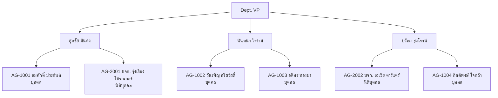
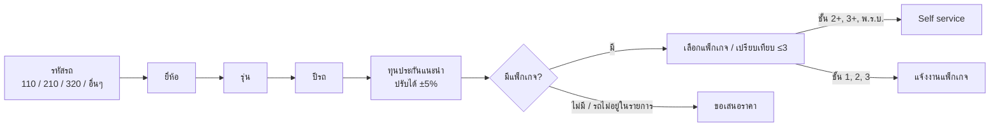
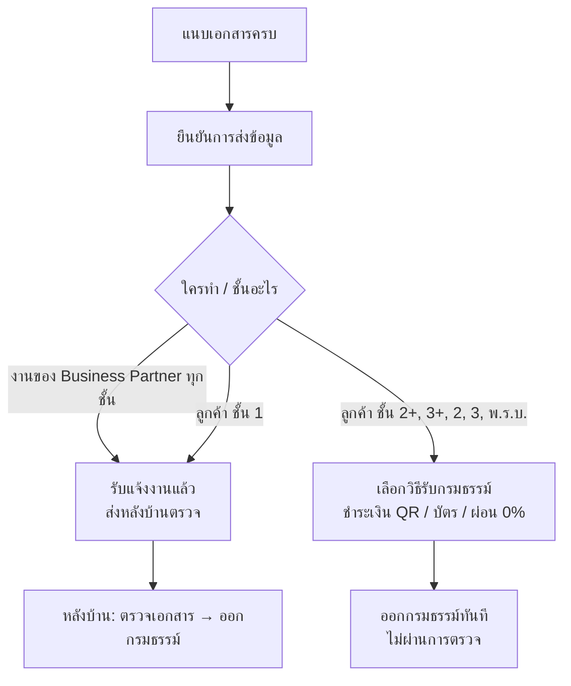
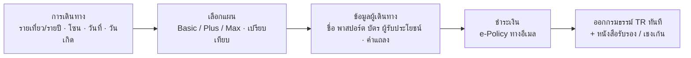
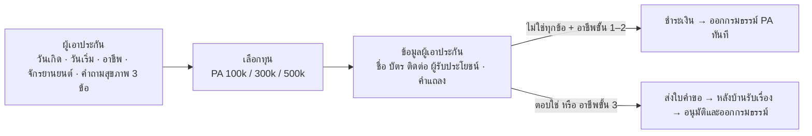
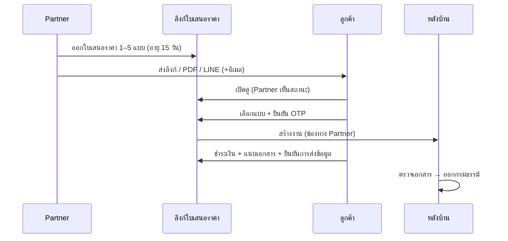
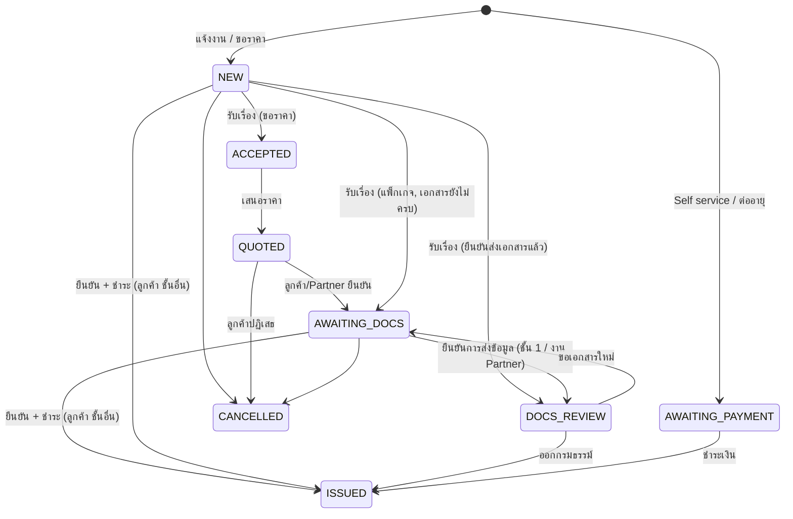
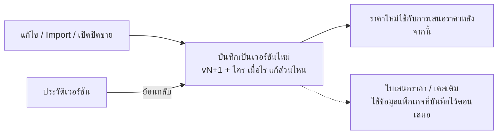
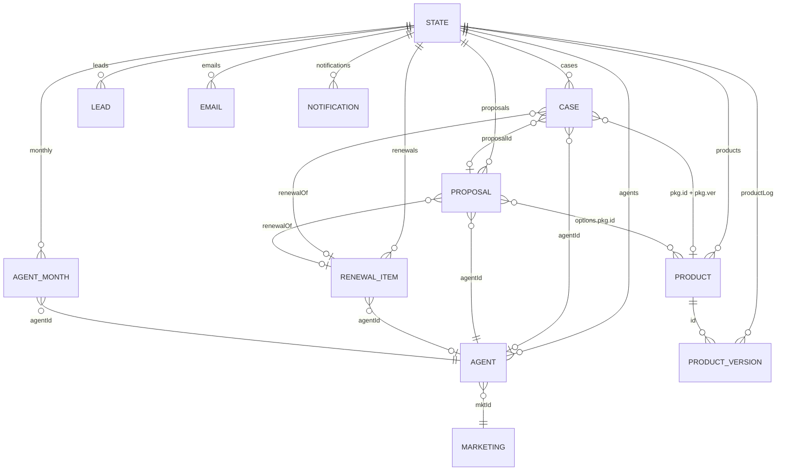

# Jacky Motor Insurance Demo: โครงสร้างระบบ

เอกสารนี้อธิบายโครงสร้างของระบบจำลองการขายประกันรถยนต์ของบริษัท Jacky (บริษัทสมมติ) ตั้งแต่ผู้ใช้แต่ละฝั่ง เส้นทางการทำงาน สถานะงาน กติกาธุรกิจ โครงสร้างข้อมูล ไปจนถึงโครงสร้างโค้ดและวิธี build/test

> ข้อมูลทั้งหมดเป็นตัวอย่าง: รุ่นรถ ราคา เบี้ย อัตราคอมมิชชัน ชื่อตัวแทน และเกณฑ์ต่างๆ ไม่ใช่อัตราจริง

---

## 1. ภาพรวม

| หัวข้อ | รายละเอียด |
|---|---|
| รูปแบบ | Single-page app ไฟล์ HTML ไฟล์เดียว ไม่ต้องมี server หรือ database |
| เทคโนโลยี | React 18 + TypeScript, bundle ด้วย esbuild |
| การเก็บข้อมูล | `localStorage` (state ทั้งหมด), `IndexedDB` (ไฟล์รูปที่แนบ) |
| เรียลไทม์ | `BroadcastChannel` (ส่ง state ทั้งก้อน) + `storage` event ระหว่างแท็บในเบราว์เซอร์เดียวกัน · ทุกการบันทึกเพิ่มเลข `rev` แท็บจะใช้สำเนาที่ใหม่ที่สุดเสมอ (localStorage ข้ามแท็บอัปเดตไม่พร้อมกัน ถ้าไม่เช็คอาจบันทึกทับงานของอีกแท็บ) |
| ภาษา | ไทย / อังกฤษ สลับได้ทุกหน้า |
| ธีม | สว่าง / มืด ตามการตั้งค่าเครื่อง |
| ฉบับ Offline | ฟอนต์และรูปฝังในไฟล์ เปิดได้โดยไม่ต้องต่ออินเทอร์เน็ต |

---

## 2. ผู้ใช้และหน้าจอ


### 2.1 เมนู

แถบด้านบนมี 2 ส่วน คือ **หน้าลูกค้า** กับ **ระบบ Jacky** ส่วนเครื่องมือเดโมอยู่ในเมนู ⚙ มุมขวา

```
[Jacky]  หน้าลูกค้า | ระบบ Jacky                    TH/EN   ⚙ เครื่องมือเดโม ▾
```

**ระบบ Jacky** มีเมนูด้านซ้าย จัดกลุ่มตามงาน กด "« ซ่อนเมนู" / "☰ แสดงเมนู" ได้ ระบบจำค่าไว้ (บนมือถือเป็นแถบเลื่อนแนวนอนเสมอ):

| กลุ่ม | เมนู | ผู้ใช้ | ลิงก์ |
|---|---|---|---|
| ปฏิบัติการ | งานเข้า | เจ้าหน้าที่ประกัน (เลือก "ทำงานในนาม") | `#backoffice` |
| | ผู้สนใจ (Leads) | เจ้าหน้าที่ | `#leads` |
| | นำส่งเบี้ย | เจ้าหน้าที่ | `#remit` |
| ผลิตภัณฑ์ | แพ็กเกจ | ทีมผลิตภัณฑ์ (ข้อ 7.4) | `#products` |
| ช่องทาง Partner | Marketing | Marketing ของ Jacky | `#marketing` |
| | VP | Vice President | `#vp` |
| รายงาน | Dashboard | ผู้บริหาร | `#dashboard` |

**เครื่องมือเดโม (⚙):** อีเมลจำลอง (`#mail`), แบ่งจอ (`#split`), รีเซ็ตข้อมูลเดโม

**ไม่มีในเมนู:**
- Business Partner: เข้าทางปุ่ม "สำหรับตัวแทน" ในหน้าลูกค้า + OTP เท่านั้น
- ใบเสนอราคา: ลูกค้าของ Partner เปิดจากลิงก์ `#offer/{เลขที่}`

### 2.2 โครงสร้างองค์กร (ข้อมูลตัวอย่าง)



- เจ้าหน้าที่หลังบ้าน 5 คน
- การย้าย Partner ระหว่าง Marketing ทำได้เฉพาะหน้า VP

---

## 3. หน้าลูกค้า

### 3.1 เลือกรถและแพ็กเกจ



- **รหัสรถ:** 110 รถเก๋ง/รถยนต์นั่ง, 210 รถตู้, 320 รถกระบะ ระบบกรองยี่ห้อและรุ่นตามรหัส
- **แคตตาล็อก:** 11 ยี่ห้อ 39 รุ่น ระบุช่วงปีที่ขายในไทยและราคารถใหม่
- **ทุนประกันแนะนำ:** ราคารถใหม่ × 0.95 × 0.9^อายุรถ (ต่ำสุด 30%) ปัดลงหลักหมื่น
- **ช่วยตัดสินใจ:** ป้ายขายดี / คุ้มที่สุด, ผ่อน 0%, ความคุ้มครองแบบสถานการณ์, เปรียบเทียบสูงสุด 3 แพ็กเกจ, "ส่งราคาให้ฉัน" (Lead)
- **แพ็กเกจที่แสดง:** เฉพาะแพ็กเกจที่เปิดขายให้ลูกค้าและยังไม่เลยวันหมดเขต การ์ดแสดงชื่อแพ็กเกจและความคุ้มครองเสริม (หน้าลูกค้าไม่มีแท็บแคตตาล็อกผลิตภัณฑ์)

### 3.2 แพ็กเกจ (ข้อมูลตั้งต้น)

แพ็กเกจทั้งหมดมาจากแคตตาล็อกผลิตภัณฑ์ที่หลังบ้านแก้ได้ (ดูข้อ 7.4) ตารางนี้คือค่าตั้งต้น 11 แพ็กเกจ

| ชั้น | เงื่อนไข | หมายเหตุ |
|---|---|---|
| ชั้น 1 | รถอายุ ≤ 10 ปี (ซ่อมห้าง ≤ 5 ปี) | ซ่อมห้าง / ซ่อมอู่ / มีค่าเสียหายส่วนแรก |
| ชั้น 2+ | รถอายุ ≤ 15 ปี ไม่ใช่ EV | ทุน 200,000 / 300,000 |
| ชั้น 3+ | รถอายุ ≤ 15 ปี ไม่ใช่ EV | ทุน 100,000 / 200,000 |
| ชั้น 2 | ไม่ใช่ EV | รถหาย/ไฟไหม้ |
| ชั้น 3 | ทุกคัน | บุคคลภายนอกเท่านั้น |
| พ.ร.บ. | ตามรหัสรถ | 110 ฿645.21, 210 ฿1,182.35, 320 ฿967.28 ซื้อพ่วงได้ |
| ชั้น 1 EV Plus | รถไฟฟ้าเท่านั้น อายุ ≤ 5 ปี | ตัวอย่างโปรโมชัน: ป้าย "ใหม่", ค่าคอมพิเศษ 20% (บริษัท รุ่งเรือง 22%), มีวันหมดเขตขาย |

เบี้ยชั้น 1 เป็นตารางตามช่วงทุนทีละ 100,000 บาท แยกรหัสรถ (คำนวณจากสูตรเดิมที่กลางช่วงทุน) รถ EV บวกเพิ่มตาม % ที่ตั้งไว้ในแพ็กเกจ

รุ่นที่ติดป้าย `noPackage` (เช่น Mazda MX-5, Ranger Raptor, BYD Seal) ต้องขอเสนอราคาเท่านั้น

### 3.3 เอกสารที่ต้องแนบ

| กรณี | เอกสาร |
|---|---|
| ชั้น 1 | รูปรถด้านหน้า / หลัง / ซ้าย / ขวา + สำเนาเล่มรถ + สำเนาบัตรประชาชน |
| ชั้น 2+, 3+, 2, 3, พ.ร.บ. | สำเนาเล่มรถ + สำเนาบัตรประชาชน |
| ต่ออายุกับ Jacky | ไม่ต้องแนบ |

รายการเอกสารตั้งได้รายแพ็กเกจ ค่าตั้งต้นเป็นไปตามตารางนี้ งานแต่ละเคสจำรายการตอนเสนอราคาไว้ (แก้แพ็กเกจทีหลังไม่กระทบเคสเดิม)

- รับเฉพาะ `.jpg` ไม่เกิน 3MB ต่อรูป
- ตอนขอเสนอราคา ยังไม่ต้องแนบ แนบหลังยอมรับราคา
- ตัวช่วย:
  - ถ่ายบัตร/เล่มรถแล้ว "อ่าน" มากรอกฟอร์ม (จำลอง OCR)
  - ถ่ายรูปรถด้วยมือถือผ่าน QR (จำลอง)
  - ปุ่ม "ใช้ข้อมูลจำลอง" แนบครบในคลิกเดียว (มีลายน้ำ SAMPLE)

### 3.4 ยืนยันการส่งข้อมูล

แนบครบแล้วต้องกด **ยืนยันการส่งข้อมูล** งานจึงไปถึงหลังบ้าน (และ SLA ออกกรมธรรม์เริ่มนับ)



ใช้กับงานเลือกแพ็กเกจ งานขอเสนอราคา และงานของ Partner ส่วน Self service มีหน้าชำระเงินของตัวเองอยู่แล้ว

### 3.5 หลังได้กรมธรรม์ และติดตามคำขอ

- **หลังได้กรมธรรม์:** บัตรประกันดิจิทัล, แจ้งเคลม (แจ้งหลังบ้านทันที), ตั้งเตือนต่ออายุ 60/30/7 วันและต่อภาษี, โค้ดชวนเพื่อน
- **ติดตามคำขอ:** ค้นด้วยเลขที่คำขอ หรือเลขทะเบียน (ไม่สนช่องว่างและขีด)

---

### 3.6 ประกันเดินทาง

หน้าลูกค้าเริ่มจากการ์ดเลือกประกัน: **ประกันรถยนต์** (ขั้นตอนข้อ 3.1–3.5) · **ประกันเดินทาง** (3.6) · **ประกันอุบัติเหตุ** (3.7) · ประกันอัคคีภัย (Coming soon ยังกดไม่ได้)



| หัวข้อ | กติกา |
|---|---|
| แบบความคุ้มครอง | รายเที่ยว 1–180 วัน · รายปี คุ้มครอง 1 ปี เดินทางได้ไม่จำกัดครั้ง ครั้งละไม่เกิน 90 วัน |
| โซน (ตั้งค่าได้) | เอเชีย · ทั่วโลก (ยกเว้นอเมริกา, เชงเก้น) · ทั่วโลกรวมอเมริกา (เชงเก้น) |
| แผน (ตั้งค่าได้) | Basic ค่ารักษา 2 ล้าน · Plus 4 ล้าน (แนะนำ) · Max 8 ล้าน · ความคุ้มครอง 8 รายการ: ค่ารักษาพยาบาล, เสียชีวิต/ทุพพลภาพ, เคลื่อนย้ายฉุกเฉิน, ยกเลิกการเดินทาง, กระเป๋าเสียหาย, กระเป๋าล่าช้า, เที่ยวบินล่าช้า, ความรับผิดต่อบุคคลภายนอก |
| ราคา | ตารางเบี้ยตามช่วงจำนวนวัน × โซน (รายปี: ราคาต่อโซน) · อายุเกิน 70 ปี เบี้ยเพิ่ม 50% · รับถึงอายุ 80 ปี · 1 คนต่อ 1 กรมธรรม์ |
| เชงเก้น | ใช้ยื่นวีซ่าได้เมื่อโซนรองรับเชงเก้นและค่ารักษา ≥ 1.1 ล้านบาท (ประมาณ 30,000 ยูโร) หนังสือรับรองมีข้อความรับรอง |
| เอกสาร / ตรวจ | แนบสำเนาบัตรประชาชนและหนังสือเดินทางในฟอร์ม (ถ่ายรูปแล้ว OCR จำลองกรอกชื่อ เลขบัตร ที่อยู่ และเลขพาสปอร์ตให้) ไม่ต้องให้เจ้าหน้าที่ตรวจ ออกกรมธรรม์เมื่อชำระเงิน (หรือเมื่อ Partner แจ้งว่ารับเงินแล้ว) |
| ค่าคอม | มาตรฐาน 20% ของเบี้ยสุทธิ ตั้งค่าคอมพิเศษรายแผนได้ |
| ต่ออายุ | รายเที่ยวไม่มีการต่ออายุ |

**Partner:** แท็บขายมีตัวเลือก "ประกันรถยนต์ / ประกันเดินทาง" ใช้กติกาเดียวกับรถ (ขายทันทีพร้อมความยินยอม หรือใบเสนอราคา 1–3 แผน ส่วนลดหักจากค่าคอม ลิงก์ให้ลูกค้ายืนยันด้วย OTP และจ่าย หรือ Partner เก็บเงินแล้วนำส่งภายใน 15 วัน)

### 3.7 ประกันอุบัติเหตุส่วนบุคคล (PA)



| หัวข้อ | กติกา |
|---|---|
| แผน (ตั้งค่าได้) | PA 100,000 · PA 300,000 (แนะนำ) · PA 500,000 ความคุ้มครองเหมือนกันต่างวงเงิน: เสียชีวิต/สูญเสียอวัยวะ/ทุพพลภาพถาวร (อ.บ.1), ค่ารักษาต่ออุบัติเหตุ, ค่าชดเชยรายวันผู้ป่วยใน, ค่าปลงศพ |
| ราคา | เบี้ยต่อปีตามขั้นอาชีพ 1 / 2 / 3 (เช่น PA 300,000 = 1,590 / 2,050 / 2,750) · จักรยานยนต์ +30% · อาชีพเสี่ยงสูง (ขั้น 4) ไม่รับออนไลน์ |
| อายุ | รับใหม่ 15–65 ปี · ต่ออายุได้ถึง 70 ปี |
| การพิจารณา | ตอบ "ใช่" ในคำถามสุขภาพ หรืออาชีพขั้น 3 → สถานะ "รอรับเรื่อง" ให้หลังบ้านรับเรื่องและอนุมัติ · อาชีพอื่นๆ (ระบุ) คิดราคาขั้น 2 และส่งพิจารณาเสมอ · นอกนั้นออกกรมธรรม์ทันทีเมื่อชำระเงิน |
| ผู้เอาประกัน | 1 คนต่อ 1 กรมธรรม์ ต้องระบุผู้รับประโยชน์ · แนบสำเนาบัตรประชาชน (OCR กรอกชื่อ เลขบัตร ที่อยู่ให้) |
| วันเริ่มคุ้มครอง | ประกันเดินทางและ PA เริ่มได้ตั้งแต่วันนี้เป็นต้นไป ถ้ารับใบเสนอราคา ชำระ หรืออนุมัติหลังวันเริ่มเดิม ความคุ้มครองเลื่อนมาเริ่มวันนั้น (จำนวนวันเท่าเดิม / PA 1 ปี) |
| รับกรมธรรม์ | e-Policy หรือกรมธรรม์กระดาษ (ทุกประเภท): เลือกใช้ที่อยู่ตามบัตรประชาชน หรือระบุที่อยู่เอง |
| ค่าคอม | มาตรฐาน 18% ของเบี้ยสุทธิ ตั้งค่าคอมพิเศษรายแผนได้ |
| ต่ออายุ | กรมธรรม์ 1 ปี อยู่ในรายงานต่ออายุของ Partner / Marketing เหมือนประกันรถ (ราคาเดิม ไม่มีส่วนลดไม่มีเคลม) · ต่ออายุไม่ต้องตอบคำถามสุขภาพใหม่ · ลูกค้าเปิดเตือนต่ออายุได้ |

**Partner:** แท็บขายมี "ประกันอุบัติเหตุ" กติกาเดียวกับรถและเดินทาง · ใบคำขอที่ต้องพิจารณา เก็บเงินได้แต่ออกกรมธรรม์เมื่อหลังบ้านอนุมัติ

---

## 4. Business Partner

### 4.1 เข้าสู่ระบบ

ปุ่ม "สำหรับตัวแทน" ที่หน้าลูกค้า → กรอกรหัสตัวแทน → OTP ส่งไปเบอร์ที่ลงทะเบียน (จำลอง) → หน้า Business Partner

- **ข้อมูลทดสอบ:** รหัส `AG-1001` ถึง `AG-1004`, `AG-2001`, `AG-2002` · OTP `246810`
- **ตัวแทนที่ถูกระงับ:** เข้าไม่ได้
- **การจำล็อกอิน:** เก็บไว้ในแท็บนั้น (`sessionStorage`) มีปุ่มออกจากระบบ

### 4.2 แท็บ

| เมนู | หน้าที่ |
|---|---|
| ผลิตภัณฑ์ | แพ็กเกจที่ Partner รายนี้ขายได้ พร้อมค่าคอมของตัวเอง · "เช็คเบี้ยรถคุณ" ไปหน้าขาย |
| ขาย / เสนอราคา | เลือกรถในหน้าเดียว · โหมด **ซื้อเลย** (1 แพ็กเกจ + พ.ร.บ., ยืนยันแทนเมื่อลูกค้ายินยอม) หรือ **ออกใบเสนอราคา** (1–5 แพ็กเกจ อายุ 15 วัน) · ให้ส่วนลด · รุ่นที่ไม่มีแพ็กเกจส่งขอราคาหลังบ้าน |
| ใบเสนอราคา | สถานะ: ยังไม่ส่ง / ส่งแล้ว / ลูกค้าเปิดดู / ยืนยัน / ไม่สนใจ / หมดอายุ · ส่งทางลิงก์ PDF LINE |
| งานของฉัน | แนบเอกสารแทนลูกค้า · ยืนยันราคาที่หลังบ้านเสนอ · เก็บเงิน · แจ้งนำส่งเบี้ย |
| รายงานต่ออายุ | Dropdown "หมดอายุใน 1 / 2 / 3 เดือน" (ค่าเริ่มต้น 1) · ต่อแล้ว / ยังไม่ต่อ · เบี้ยที่ได้รับ / คาดว่าจะได้รับ · รายการเรียงตามวันครบกำหนด |
| ผลงานของฉัน | ยอดเดือนนี้ · คอมฯ ได้รับแล้ว / รอรับ · เป้ายอดเทียบจังหวะ · งานที่ต้องติดตาม |

### 4.3 ส่วนลดและคอมมิชชัน

| ชั้น | อัตราคอมมิชชันมาตรฐาน (ของเบี้ยสุทธิ ไม่รวม VAT และอากร) |
|---|---|
| ชั้น 1 | 18% |
| ชั้น 2+, 3+, 2, 3 | 15% |
| พ.ร.บ. | 12% |

- **ลำดับสิทธิ์ค่าคอม:** ค่าคอมเฉพาะ Partner ของแพ็กเกจนั้น > ค่าคอมพิเศษของแพ็กเกจ (สูงหรือต่ำกว่ามาตรฐานก็ได้) > มาตรฐานตามชั้น
- อัตราที่ใช้จะถูกบันทึกไว้กับแพ็กเกจตอนเสนอราคา แก้ค่าคอมทีหลังไม่กระทบใบเสนอราคาและเคสเดิม

- **ส่วนลด:** Partner ให้ส่วนลดเองได้ หักจากคอมมิชชันของตัวเอง ลดได้ไม่เกินอัตราคอมฯ ที่ใช้จริงของแพ็กเกจ และ พ.ร.บ. ลดไม่ได้
- **ใบเสนอราคา:** แสดงราคาเต็มขีดฆ่าคู่กับราคาหลังหักส่วนลด ลูกค้าไม่เห็นคอมมิชชัน
- **เบี้ยสุทธิ:** เบี้ยรวม ÷ 1.07428

### 4.4 การชำระเงินและนำส่งเบี้ย

| ช่องทาง | กำหนด | สถานะ |
|---|---|---|
| ลูกค้าจ่ายผ่านลิงก์ | ภายใน 15 วันหลังยืนยัน | ตามเกณฑ์ / ชำระล่าช้า / รอชำระ / เกินกำหนด |
| Partner เก็บเงินแล้วนำส่ง | ภายใน 15 วันหลังออกกรมธรรม์ | ตามเกณฑ์ / ชำระล่าช้า / รอนำส่ง / เกินกำหนด |

คอมมิชชันนับเป็น "ได้รับแล้ว" เมื่อ Jacky ได้รับเงินครบ

### 4.5 ใบเสนอราคา (หน้าลูกค้าของ Partner)



### 4.6 ต่ออายุกับ Jacky

1. Partner กด "ออกใบเสนอต่ออายุ" จากรายงานต่ออายุ ระบบกรอกรถและลูกค้าจากกรมธรรม์เดิม
2. ลูกค้าตกลง (ซื้อเลย หรือผ่านลิงก์) แล้ว **ไม่ต้องแนบเอกสาร**
3. ลูกค้าจ่ายผ่านลิงก์ หรือ Partner กด "เก็บเงินจากลูกค้าแล้ว" → ออกกรมธรรม์ใหม่ทันที
4. งานต่ออายุไม่นับ SLA และถ้าเปลี่ยนรถในฟอร์ม จะกลายเป็นงานใหม่ปกติ

---

## 5. Marketing

| เมนู | หน้าที่ |
|---|---|
| ผลงานตัวแทน | เบี้ย คอมฯ เป้า อัตราปิดการขาย (ใบเสนอที่ยืนยัน ÷ ใบเสนอที่ออก) ส่วนลดเฉลี่ย · เดือนนี้ / 90 วัน |
| การต่ออายุ | อัตราต่ออายุรวมและราย Partner · เบี้ยที่ได้รับ / คาดว่าจะได้รับ · รายการยังไม่ต่อพร้อมปุ่มทวงถาม |
| ตั้งเป้า / จัดการตัวแทน | เป้า/เดือน (แก้ได้) · ทำได้เดือนนี้ · % ทำได้เทียบจังหวะ · ระงับ / เปิดใช้ |
| ติดตามงาน | ต่ออายุที่ครบใน 60 วัน · เบี้ยเกินกำหนด · ทวงถาม (อีเมลถึงตัวแทน) |
| เยี่ยม Partner | รายชื่อ Partner พร้อมวันเยี่ยมล่าสุด นัดครั้งต่อไป และ % เป้าเดือนนี้ · ปุ่ม **รายงานเยี่ยม** และ **บันทึกการเยี่ยม** · ประวัติการเยี่ยม |

**รายงานเยี่ยม Partner** (ใช้ภายใน แสดงทุกตัวเลข) พิมพ์ A4 แนวตั้ง 2 หน้า:

| หน้า | เนื้อหา |
|---|---|
| 1 | ข้อมูล Partner และ Marketing ผู้ดูแล · ตัวเลขสรุป 5 ช่อง: เบี้ยเดือนนี้เทียบเป้าถึงวันนี้ (และยอดที่ยังขาดถึงเป้าเดือน), กรมธรรม์ + ค่าคอมเดือนนี้, อัตราต่ออายุ 12 เดือน, อัตราปิดการขาย 90 วัน, Loss Ratio 12 เดือน · ตารางเดือนนี้ / YTD / 12 เดือน: เป้า เบี้ย % ทำได้ กรมธรรม์ ต่ออายุ Loss Ratio อันดับ · กราฟเบี้ยรายเดือน 12 เดือนพร้อมเส้นเป้า |
| 2 | ยอดขายตามชั้นประกัน (กรมธรรม์ เบี้ย สัดส่วน เบี้ยเฉลี่ย) · แพ็กเกจขายดี 5 อันดับ · งานใหม่ / ต่ออายุ (YTD) · ประเด็นที่จะคุย (Marketing พิมพ์ก่อนพิมพ์รายงาน) · การเยี่ยมครั้งก่อน |

- **บันทึกการเยี่ยม:** วันที่เยี่ยม, ประเด็นที่คุย (ดึงจากรายงาน), ผลการคุย (บังคับ), นัดครั้งต่อไป
- **VP:** คอลัมน์ "การเยี่ยม" (เยี่ยมล่าสุด / นัดครั้งต่อไป) ในตาราง Performance ราย Partner และการ์ด "การเยี่ยม Partner ล่าสุด"

---

## 6. Vice President

- **ช่วงเวลา:**
  - **Rolling 12 เดือน:** 12 เดือนที่ปิดยอดแล้ว
  - **เดือนนี้:** ยอดถึงวันนี้ เทียบเป้าตามสัดส่วนวัน
- **ตัวเลขสรุป:** GWP เทียบเป้า, จำนวนกรมธรรม์, อัตราต่ออายุ + GWP ต่ออายุ, Loss Ratio
- **โครงสร้างและอันดับ:** VP → Marketing → Partner เรียงตาม % ทำได้
- **กราฟ Rolling 12 เดือน:** Clustered bar ราย Partner (สีตาม Marketing, Partner คนที่สองเป็นลายเส้น) หรือราย Marketing · % เป้า / GWP · ดูเป็นตารางได้
- **อันดับ Marketing:** เป้า, จริง, % ทำได้, กรมธรรม์, สัดส่วน, อัตราต่ออายุ, GWP ต่ออายุ, Loss Ratio
- **Performance ราย Partner:** ตัวเลขเดียวกัน และ **มอบหมาย Marketing ผู้ดูแล** (ทำได้ที่หน้านี้เท่านั้น)
- **เกณฑ์ Loss Ratio (ตัวอย่าง):** ≤55% ปกติ, ≤70% เฝ้าระวัง, >70% สูง

---

## 7. หลังบ้าน

### 7.1 เมนูกลุ่มปฏิบัติการ

| เมนู | หน้าที่ |
|---|---|
| งานเข้า | คิวงาน ตัวกรอง (สถานะ ชั้น ช่องทาง/Partner ผู้รับผิดชอบ) · รับเรื่อง มอบหมาย เสนอราคา ตรวจเอกสาร ขอเอกสารใหม่ ออกกรมธรรม์ ยกเลิก โน้ต · กล่องข้อมูล Partner (ส่วนลด คอมฯ การชำระ) |
| ผู้สนใจ (Leads) | คนที่กด "ส่งราคาให้ฉัน" · ทำเครื่องหมายติดต่อแล้ว |
| นำส่งเบี้ย | เบี้ยที่ Partner เก็บเอง · บันทึกรับเงินนำส่ง · แจ้งเตือนเมื่อ Partner แจ้งว่าโอนแล้ว |

### 7.2 สถานะงาน



| สถานะ | ความหมาย |
|---|---|
| `NEW` | ใหม่ รอรับเรื่อง |
| `AWAITING_PAYMENT` | รอชำระเงิน (Self service, ต่ออายุ) |
| `ACCEPTED` | รับเรื่องแล้ว (ขอเสนอราคา) |
| `QUOTED` | เสนอราคาแล้ว รอลูกค้ายืนยัน |
| `AWAITING_DOCS` | รอเอกสาร / รอยืนยันการส่งข้อมูล |
| `DOCS_REVIEW` | ตรวจเอกสาร |
| `ISSUED` | ออกกรมธรรม์แล้ว |
| `CANCELLED` | ยกเลิก |

### 7.3 SLA

นับเฉพาะเวลาทำการ จันทร์–ศุกร์ 08:30–17:30 (เวลาไทย) ไม่หักวันหยุดนักขัตฤกษ์

| SLA | เริ่มนับ | หยุดนับ | เป้าหมาย |
|---|---|---|---|
| รับเรื่อง | ส่งคำขอ | รับเรื่อง | 15 นาที |
| เสนอราคา | ส่งคำขอเสนอราคา | ส่งใบเสนอราคา | 2 ชั่วโมง |
| ออกกรมธรรม์ | ยืนยันการส่งข้อมูล (หรือรับเรื่อง ถ้าทีหลัง) | ออกกรมธรรม์ | 1 วันทำการ |

- **ไม่นับ SLA:** Self service และงานต่ออายุ
- **เมื่อเกิน SLA:** แจ้งเตือนหลังบ้านและส่งอีเมลถึงทีมหนึ่งครั้ง

---

### 7.4 ผลิตภัณฑ์

เข้าจาก **ระบบ Jacky → ผลิตภัณฑ์ → ประกันรถยนต์**

**รายการ:** การ์ดสรุปสถานะด้านบน (ทั้งหมด / เปิดขาย / ปิดขาย / ใกล้หมดเขต ≤30 วัน / หมดเขตแล้ว / ค่าคอมพิเศษ) กดเพื่อกรอง · ทุกแพ็กเกจแยกตามชั้น · สวิตช์เปิด/ปิดขายแยกช่องทาง (ลูกค้า / Partner) · ช่วงเบี้ย · วันหมดเขตขาย · ค่าคอม · ยอดขาย · อัตราปิดการขายจากใบเสนอราคา · เวอร์ชัน · ปุ่มแก้ไข / คัดลอก / สร้างใหม่

**หน้าแก้ไข:** แบ่ง 4 แท็บ — **ข้อมูลทั่วไป** (การตลาด, เงื่อนไขรับประกัน) · **ความคุ้มครอง** (ความคุ้มครอง, ความคุ้มครองเสริม, เอกสาร, เงื่อนไขและข้อยกเว้น) · **ราคา & ค่าคอม** (ตารางเบี้ย, ค่าคอม) · **การขาย** (ช่องทาง, Partner, วันหมดเขต) แท็บที่แก้แล้วมีจุด แท็บที่มีข้อผิดพลาดมีจุดแดง

- ฟอร์มวางแบบ Z: ชื่อช่องอยู่ซ้าย ช่องกรอกอยู่ขวา 2 คอลัมน์ต่อแถวบนจอกว้าง (มือถือ 1 คอลัมน์) ทุกส่วนใช้ความกว้างคอลัมน์เดียวกันให้ตรงกันแนวตั้ง
- แท็บความคุ้มครองแยกเป็นการ์ดย่อย: ความคุ้มครองตัวรถ / ความรับผิดต่อบุคคลภายนอก / ร.ย.01–03 / ความคุ้มครองเสริม แต่ละการ์ด (และการ์ดเอกสาร) มีปุ่ม **เติมตามมาตรฐาน** เติมเฉพาะส่วนนั้น ส่วนปุ่มด้านบนเติมทุกส่วน
- **แถบบันทึกติดล่างจอ:** แสดง "ยังไม่บันทึก n ส่วน" · ยกเลิกการแก้ไข · บันทึกเป็นเวอร์ชันใหม่ → หน้าต่าง **ตรวจก่อนบันทึก** สรุปผลกระทบ (ช่องทาง วันหมดเขต จำนวนช่องราคาที่เปลี่ยน ค่าคอม) + หมายเหตุ ถ้ามีข้อผิดพลาดจะมีลิงก์ไปแท็บนั้น
- ออกจากหน้าหรือปิดแท็บเบราว์เซอร์ขณะยังไม่บันทึกจะถามยืนยัน
- ประวัติเวอร์ชันเปิดเป็นแผงด้านขวา ย้อนกลับได้ (ถามยืนยัน)
- ตารางเบี้ยอยู่ในกรอบเลื่อน หัวตารางค้างไว้ · ช่อง "ไปที่ช่วงทุน" กระโดดไปแถวนั้น

| ส่วน | รายละเอียด |
|---|---|
| ข้อมูลการตลาด | ชื่อ TH/EN, คำโปรย, จุดเด่น (บรรทัดละข้อ), ป้าย "แนะนำ" / "ใหม่" |
| การขาย | เปิดขายลูกค้า / Partner, Partner ทุกรายหรือเฉพาะที่เลือก, วันที่ขายได้ถึง (เลยแล้วลูกค้าและ Partner ไม่เห็น) |
| ความคุ้มครอง | ปุ่ม **"ใส่ความคุ้มครองมาตรฐาน"** ของชั้นนั้น แล้วปรับต่อได้ · การซ่อม, ค่าเสียหายส่วนแรก, ความเสียหายต่อตัวรถ / รถหายไฟไหม้ (ไม่คุ้มครอง / ตามทุน / จำนวนคงที่ / % ของทุนมีเพดาน), วงเงินบุคคลภายนอก · **ความคุ้มครองตามเอกสารแนบท้าย** แยกตามตารางกรมธรรม์: ร.ย.01 เสียชีวิต/ทุพพลภาพถาวร ผู้ขับขี่ 1 คน และผู้โดยสาร (ต่อคน), ร.ย.01 ทุพพลภาพชั่วคราว (ต่อสัปดาห์ ผู้ขับขี่ / ผู้โดยสาร ใส่ 0 = ไม่คุ้มครอง), ร.ย.02 ค่ารักษาพยาบาล (ต่อคน), ร.ย.03 ประกันตัวผู้ขับขี่ (ต่อครั้ง), จำนวนผู้โดยสาร (ค่าตั้งต้นตามรหัสรถ 110: 6, 210: 11, 320: 2) |
| ความคุ้มครองเสริม | น้ำท่วม, ช่วยเหลือฉุกเฉิน, รถยก, รถใช้ระหว่างซ่อม, แบตเตอรี่ EV, กระจก (รวมในเบี้ย) |
| เงื่อนไขรับประกัน | อายุรถสูงสุด, รหัสรถทั้งหมดหรือบางรหัส, รถ EV (รับ / ไม่รับ / เฉพาะ EV), % เบี้ยเพิ่มสำหรับ EV, รุ่นรถที่ไม่รับ |
| ตารางเบี้ย | ช่วงทุน × รหัสรถ (110 / 210 / 320) ช่องว่าง = ไม่รับ · ตรวจช่วงทุนทับกัน · ช่องทดลองคำนวณ |
| เอกสาร | เลือกเอกสารที่ต้องแนบ |
| ค่าคอม | มาตรฐาน หรือค่าคอมพิเศษ + ตารางค่าคอมเฉพาะ Partner แสดงอัตราที่ใช้จริง |
| เงื่อนไขและข้อยกเว้น | ข้อความ TH/EN, แนบ PDF เงื่อนไขกรมธรรม์ (Partner ดาวน์โหลดได้จากแคตตาล็อก) |

**ประกันเดินทาง** เข้าจาก **ระบบ Jacky → ผลิตภัณฑ์ → ประกันเดินทาง**: รายการแผน (เปิด/ปิดขายแยกลูกค้า/Partner, ช่วงเบี้ย, ค่ารักษา, ค่าคอม, ยอดขาย) · ปุ่มสร้าง/คัดลอกแผน · จัดการโซนการเดินทาง · หน้าแก้ไข: ข้อมูลการตลาดและช่องทาง, ความคุ้มครอง 8 รายการ (บอกว่าถึงเกณฑ์เชงเก้นหรือไม่), ตารางเบี้ยรายเที่ยว, เบี้ยรายปี, อายุสูงสุดและเบี้ยเพิ่มตามอายุ, ค่าคอม, เงื่อนไข · บันทึกเป็นเวอร์ชันใหม่และย้อนกลับได้เหมือนประกันรถ

**ประกันอุบัติเหตุ** เข้าจาก **ระบบ Jacky → ผลิตภัณฑ์ → ประกันอุบัติเหตุ**: รายการแผน (เปิด/ปิดขายแยกช่องทาง, ทุนประกัน, ช่วงเบี้ย, % จักรยานยนต์, ค่าคอม, ยอดขาย) · จำนวนใบคำขอรอพิจารณา · รายการขั้นอาชีพ · หน้าแก้ไข: ข้อมูลการตลาด, ความคุ้มครอง 4 รายการ, เบี้ยตามขั้นอาชีพ 1–3, % เบี้ยเพิ่มจักรยานยนต์, อายุต่ำสุด/สูงสุด/ต่ออายุ, ค่าคอม, เงื่อนไข · เวอร์ชันและย้อนกลับได้

**เวอร์ชัน:**



- แพ็กเกจที่เสนอให้ลูกค้าจะเก็บสำเนา (ชื่อ เวอร์ชัน เบี้ย ความคุ้มครองเสริม เอกสาร ค่าคอม ราคา พ.ร.บ.) ไว้ในใบเสนอราคาและเคส
- ย้อนกลับเวอร์ชัน = บันทึกเวอร์ชันเก่าเป็นเวอร์ชันใหม่ล่าสุด ประวัติไม่หาย

**Export / Import Excel:**

- **Export:** ไฟล์ `.xlsx` ชีตแรกเป็นคำอธิบาย ชีตต่อไป 1 ชีตต่อ 1 แพ็กเกจ ด้านบนเป็นค่าหลัก (รหัส ชั้น ชื่อ เปิดขาย วันหมดเขต อายุรถ ค่าคอมพิเศษ เวอร์ชันตอน Export) ด้านล่างเป็นตารางเบี้ย
- **Import:** ใช้ไฟล์ที่ Export เป็นแม่แบบ ระบบแสดงหน้าต่าง "ตรวจก่อนนำเข้า" ก่อนมีผล:
  - แพ็กเกจใหม่ / เปลี่ยน / ไม่เปลี่ยน / ผิดพลาด
  - ส่วนที่แก้ และราคาที่เปลี่ยนรายช่อง (เดิม → ใหม่)
  - ข้อผิดพลาดพร้อมตำแหน่งเซลล์ (Y/N ผิด, วันที่ผิด, ช่วงทุนทับกัน, เปลี่ยนชั้นของแพ็กเกจเดิม ฯลฯ) ชีตที่ผิดจะถูกข้าม
  - เตือนเมื่อไฟล์ Export จากเวอร์ชันเก่ากว่าปัจจุบัน
  - ค่าที่ไม่อยู่ในไฟล์ (ความคุ้มครอง ค่าคอมเฉพาะ Partner ฯลฯ) คงเดิม · รหัสใหม่ในไฟล์ = สร้างแพ็กเกจใหม่ด้วยความคุ้มครองมาตรฐาน (ปิดขายไว้ก่อน)
- อ่าน/เขียนไฟล์ด้วยโค้ดของระบบเอง (`src/lib/xlsx.ts`) ไม่ใช้ไลบรารีภายนอก ใช้ได้ทั้งไฟล์จาก Excel, Google Sheets และ Numbers

---

## 8. Dashboard

- **ตัวกรอง:** ช่วงเวลา (7 / 30 / 90 วัน / เดือนนี้), ประเภท, ยี่ห้อ, เจ้าหน้าที่, ช่องทาง (ตรง / Partner), Marketing
- **KPI:** กรมธรรม์ที่ออก, เบี้ยรวม, อัตราแปลงเป็นกรมธรรม์, SLA ผ่าน
- **Production:** รายวัน / รายเดือน แยกตามประเภท ยี่ห้อ เจ้าหน้าที่
- **ช่องทาง Partner:**
  - อันดับ Partner
  - Funnel ตัวแทน: ออกใบเสนอ → เปิดดู → ยืนยัน → ออกกรมธรรม์ → Jacky ได้รับเงิน
  - รายละเอียดการชำระ
  - Performance งานต่ออายุ
- **ผลงานรายผลิตภัณฑ์:** เบี้ยรายแพ็กเกจ, จำนวนกรมธรรม์, สัดส่วนผ่าน Partner, ค่าคอมที่จ่าย, อัตราปิดการขายจากใบเสนอราคา
- **Process Funnel:** เข้าชมเว็บ → เลือกรถ → ดูแพ็กเกจ → เลือก → แจ้งงาน → … → ออกกรมธรรม์ พร้อม Leads
- **SLA:** % ผ่านแต่ละ SLA, ค่าเฉลี่ย, P90, รายเจ้าหน้าที่, งานที่เกิน SLA

---

## 9. อีเมลจำลอง

| ถึง | อีเมล |
|---|---|
| ลูกค้า | ได้รับคำขอ · รายการเอกสารที่ต้องแนบ · ใบเสนอราคา · ขอเอกสารใหม่ · ออกกรมธรรม์ · ซื้อเองสำเร็จ · ยกเลิก · ส่งราคาให้ (Lead) · แจ้งเคลม · เตือนต่ออายุ · ใบเสนอราคาจาก Partner |
| หลังบ้าน | งานใหม่ · ลูกค้ายืนยัน · เอกสารครบ · เกิน SLA |
| ตัวแทน | ทวงถามต่ออายุ · ทวงถามนำส่งเบี้ย · ขอเอกสารใหม่ (งานของตัวเอง) |

---

## 10. โครงสร้างข้อมูล



| ข้อมูล | ฟิลด์สำคัญ |
|---|---|
| `Case` (งาน) | `id` (JKY-YYMM-NNNN), `source` (package / quote / self), `vehicle`, `coverage`, `pkg`, `addCmi`, `customer`, `status`, `stamps` (submitted, accepted, quoted, confirmed, docsComplete, paid, issued, cancelled), `docs`, `log`, `policyNo`, `premium` · ช่องทาง Partner: `agentId`, `proposalId`, `discount`, `collect` (link / agent), `paidAt`, `remittedAt` · `renewalOf` |
| `Proposal` (ใบเสนอราคา) | `id` (Q-YYMM-…), `agentId`, `options[]` (pkg + addCmi), `discountPct`, `expiresAt`, `sentVia`, `viewedAt`, `status`, `acceptedBy`, `chosen`, `caseId`, `renewalOf` |
| `Agent` | `code`, `kind` (person / company), ชื่อ, ใบอนุญาต, จังหวัด, เบอร์, LINE, `mktId`, `target` (บาท/เดือน), `active` |
| `Marketing` | `id`, ชื่อ, เบอร์ |
| `RenewalItem` | `policyNo`, ลูกค้า, รถ, ชั้น, เบี้ยเดิม, `expiry`, `status` (open / quoted / renewed / lost), `renewedPremium`, `proposalId`, `nudgedAt` |
| `AgentMonth` | ราย Partner รายเดือน: `gwp`, `policies` (ประวัติก่อนข้อมูลตัวอย่าง), `lossRatio`, `renewDue`, `renewed`, `renewGwp` |
| `Product` | `id`, `type`, `ver`, ชื่อ/คำโปรย/จุดเด่น TH-EN, `badge`, `channels`, `partners`, `saleUntil`, ความคุ้มครอง (`ownDamage`/`fireTheft` เป็นกฎ), `extras`, `maxAge`, `codes`, `ev`, `evLoading`, `excludeModels`, `rates[]` (siFrom, siTo, prices ตามรหัสรถ), `docs`, `commission`, `partnerCommission`, เงื่อนไข/ข้อยกเว้น, `pdf` |
| `ProductVersion` | `id`, `ver`, `at`, `by`, `note`, `changes[]`, `snapshot` (สำเนาแพ็กเกจทั้งก้อน) |
| `Package` (ใน Case / Proposal) | สำเนาตอนเสนอ: เบี้ย ความคุ้มครอง + `nameTh/En`, `ver`, `extras`, `docs`, `comRate`, `cmi` |
| `Lead` | ผู้ติดต่อ, รถ, ราคาเริ่มต้น, `contacted`, `caseId` เมื่อกลายเป็นงาน |
| `Email`, `Notification` | อีเมลจำลองและแจ้งเตือนหลังบ้าน |

- **ข้อมูลตัวอย่าง:** สร้างตอนเปิดครั้งแรก ประมาณ 320 งานย้อนหลัง 3 เดือน (ราว 1/3 ผ่าน Partner), ใบเสนอราคาที่ปิดและไม่ปิด, 260 กรมธรรม์ใกล้ครบกำหนด, ประวัติ 13 เดือนราย Partner
- **Store version:** เปลี่ยนแล้วข้อมูลเดิมในเบราว์เซอร์จะถูกสร้างใหม่ ปุ่ม "รีเซ็ตข้อมูลเดโม" สร้างใหม่ได้ทุกเมื่อ

---

## 11. โครงสร้างโค้ด

```
assets/
  cars/*.webp          รูปรถ (ตัดพื้นหลัง, Muted)
  fonts/               ฟอนต์ Mitr, IBM Plex Sans Thai, IBM Plex Mono
  README-offline.txt   คู่มือในไฟล์ zip ฉบับ Offline
docs/
  SYSTEM_STRUCTURE.md  เอกสารนี้
scripts/
  build.mjs            bundle เป็น dist/index.html, dist/fragment.html, dist/offline/
  e2e.mjs              ทดสอบ end-to-end (Playwright)
  offline-check.mjs    เปิดฉบับ Offline โดยบล็อกเน็ตทั้งหมด
  fetch-fonts.mjs      ดึงฟอนต์มาเก็บใน assets/fonts
src/
  main.tsx             เมนูด้านบน, เลือกหน้า, toast, session ของ Partner
  types.ts             ชนิดข้อมูลทั้งหมด
  store.ts             state + action ทั้งหมด (จุดเดียวที่เปลี่ยนข้อมูล)
  files.ts             เก็บรูปที่แนบใน IndexedDB
  i18n.ts, i18nAgent.ts, i18nProduct.ts   ข้อความไทย/อังกฤษ, รูปแบบตัวเลข/วันที่
  styles.css           ธีม, สีโหมดสว่าง/มืด, layout ทุกหน้า
  data/
    vehicles.ts        ยี่ห้อ รุ่น ปี ราคา รหัสรถ ทุนประกัน
    packages.ts        ค่ามาตรฐาน: สูตรเบี้ยชั้น 1, พ.ร.บ., เอกสาร, ผ่อน 0%, ป้ายแนะนำ
    products.ts        แคตตาล็อกผลิตภัณฑ์: ข้อมูลตั้งต้น, ความคุ้มครองมาตรฐาน, packagesFor (กรองช่องทาง/วันหมดเขต/เงื่อนไข), ค่าคอม
    agents.ts          Partner, Marketing, คอมมิชชัน, ราคาหลังส่วนลด, สถานะการชำระ
    brandLogos.ts      โลโก้ยี่ห้อ (Simple Icons, CC0)
  lib/
    time.ts            เวลาไทย, นาทีทำการ
    sla.ts             คำนวณ SLA
    seed.ts            ข้อมูลตัวอย่าง (งาน, Lead, traffic, ใบเสนอราคา, ต่ออายุ)
    history.ts         ประวัติ 12 เดือนราย Partner สำหรับ VP
    xlsx.ts            อ่าน/เขียนไฟล์ .xlsx (zip + XML)
    productSheets.ts   แคตตาล็อก ⇄ Excel และตรวจก่อนนำเข้า
    productStats.ts    ยอดขายรายผลิตภัณฑ์
    travel.ts          (data/) แผนและโซนตั้งต้น, ตารางเบี้ย, คำนวณราคาตามทริปและอายุ, แปลงแผนเป็นแพ็กเกจ TRV
    perf.ts            ผลงานราย Partner รายเดือน (เป้า เบี้ย ต่ออายุ Loss Ratio) ใช้ร่วมกันใน VP และรายงานเยี่ยม
  ui/
    Customer.tsx       หน้าลูกค้า: เลือกรถ, แพ็กเกจ, ฟอร์ม, ชำระเงิน, ติดตาม, แนบเอกสาร
    SubmitDocs.tsx     ปุ่มและหน้าต่าง "ยืนยันการส่งข้อมูล"
    PartnerLogin.tsx   ล็อกอิน Business Partner (รหัส + OTP)
    Agent.tsx          หน้า Business Partner
    AgentRenewals.tsx  รายงานต่ออายุ (Partner และ Marketing)
    Offer.tsx          ใบเสนอราคาสำหรับลูกค้า, แชร์ลิงก์/PDF/LINE
    Marketing.tsx      หน้า Marketing
    VP.tsx             หน้า Vice President
    BackOffice.tsx     หลังบ้าน
    Travel.tsx         ประกันเดินทาง: การ์ดหน้าแรก, ขั้นตอนซื้อ, ตารางความคุ้มครอง, หนังสือรับรอง, หน้าขายของ Partner
    TravelAdmin.tsx    เมนูผลิตภัณฑ์ → ประกันเดินทาง: รายการแผน, โซน, หน้าแก้ไข, เวอร์ชัน
    Pa.tsx             ประกันอุบัติเหตุ: ขั้นตอนซื้อ, คำถามสุขภาพ, ตารางกรมธรรม์, เตือนต่ออายุ, หน้าขายของ Partner
    PaAdmin.tsx        เมนูผลิตภัณฑ์ → ประกันอุบัติเหตุ: รายการแผน, หน้าแก้ไข, เวอร์ชัน
    Visits.tsx         เยี่ยม Partner: รายการ, รายงาน A4 2 หน้า, บันทึกการเยี่ยม, ประวัติ (ใช้ในหน้า VP ด้วย)
    Products.tsx       เมนูผลิตภัณฑ์: รายการ, หน้าแก้ไข, ประวัติเวอร์ชัน, Import/Export
    Catalog.tsx        แคตตาล็อกผลิตภัณฑ์ของ Partner และหน้ารายละเอียด
    Dashboard.tsx, DashAgents.tsx, DashProducts.tsx   Dashboard
    Mail.tsx           อีเมลจำลอง
    extras.tsx         OCR จำลอง, ถ่ายด้วยมือถือ, รูป/เอกสารจำลอง, หลังได้กรมธรรม์, เคลม
    charts.tsx         กราฟแท่ง, Clustered bar, แถบแนวนอน
    icons.tsx          โลโก้ยี่ห้อ, รูปรถ, QR จำลอง
    common.tsx         ป้ายสถานะ, SLA chip, Field, Segmented, Toast
```

### 11.1 Action หลักใน `store.ts`

| กลุ่ม | Action |
|---|---|
| งาน | `submitCase`, `acceptCase`, `assignCase`, `sendQuote`, `customerConfirm`, `customerDecline`, `cancelCase`, `addNote` |
| เอกสาร | `uploadDoc`, `submitDocs`, `requestReupload` |
| ออกกรมธรรม์ / ชำระ | `issuePolicy`, `payAndIssue` (Self service), `submitPayIssue` (ยืนยัน + ชำระ) |
| Partner | `createProposal`, `markProposalSent`, `viewProposal`, `declineProposal`, `acceptProposal`, `payByLink`, `agentCollected`, `agentRemitNotice`, `recordRemit` |
| ผลิตภัณฑ์ | `saveProduct`, `saveProducts` (Import), `rollbackProduct`, `productChanges` |
| Marketing / VP | `nudgeAgent`, `updateAgent` (เป้า, ระงับ, Marketing ผู้ดูแล) |
| อื่นๆ | `captureLead`, `markLeadContacted`, `fileClaim`, `setReminders`, `sendRenewalPreview`, `trackStep`, `checkSlaBreaches`, `markNotificationsRead`, `resetDemo` |

ถ้าจะต่อยอดไปใช้จริง ให้เปลี่ยน action ใน `store.ts` และ `files.ts` ให้เรียก API จริง โดยหน้าจอไม่ต้องแก้

---

## 12. Build และทดสอบ

```bash
npm install
npm run typecheck
npm run build                                          # dist/index.html, dist/fragment.html, dist/offline/
npm run package:offline                                # dist/abc-motor-insurance-demo-offline.zip
CHROMIUM_PATH=/path/to/chromium npm test               # end-to-end 50 ขั้น
CHROMIUM_PATH=/path/to/chromium npm run test:offline   # ฉบับ Offline ไม่มี network request
```

การทดสอบ end-to-end ครอบคลุม:
- ลูกค้า: เลือกแพ็กเกจ, ขอเสนอราคา, Self service, ยืนยันการส่งข้อมูล, ขอเอกสารใหม่
- หลังบ้าน
- Business Partner: ล็อกอิน OTP, ใบเสนอราคา, ส่วนลด, ต่ออายุ, นำส่งเบี้ย
- Marketing และ VP
- Dashboard
- ผลิตภัณฑ์: แก้เบี้ยเป็นเวอร์ชันใหม่ (ใบเสนอเดิมคงราคา), ย้อนเวอร์ชัน, ค่าคอมพิเศษ/เฉพาะ Partner, ปิดช่องทาง, วันหมดเขต (ไม่แสดงในแคตตาล็อก Partner และแพ็กเกจของลูกค้า), ปุ่มความคุ้มครองมาตรฐาน, Export → แก้ → Import พร้อมตรวจความต่างและข้อผิดพลาด
- ภาษาอังกฤษ

---

## 13. ข้อจำกัดของเดโม

- แก้แพ็กเกจแล้วมีผลทันทีหลังบันทึก ยังไม่มีขั้นอนุมัติ (ตามที่ตกลงให้ใช้หลังบ้านเดิม)
- ข้อมูลอยู่ในเบราว์เซอร์ที่เปิดเท่านั้น ไม่แชร์ข้ามเครื่อง อีเมล OTP การชำระเงิน และ EMS เป็นการจำลอง
- หน้า Marketing / VP / หลังบ้าน / Dashboard เปิดได้โดยไม่ต้องล็อกอิน (มีแค่ Business Partner ที่ต้องล็อกอิน)
- ยอดก่อนช่วงข้อมูลตัวอย่าง Loss Ratio และผลต่ออายุรายเดือนในหน้า VP เป็นข้อมูลจำลอง ประวัติ 12 เดือนนับ Partner ตาม Marketing ผู้ดูแลปัจจุบัน
- โลโก้ยี่ห้อเป็นเครื่องหมายการค้าของเจ้าของ ใช้เพื่อระบุยี่ห้อรถเท่านั้น

---

Designed By Jack Na Ja
