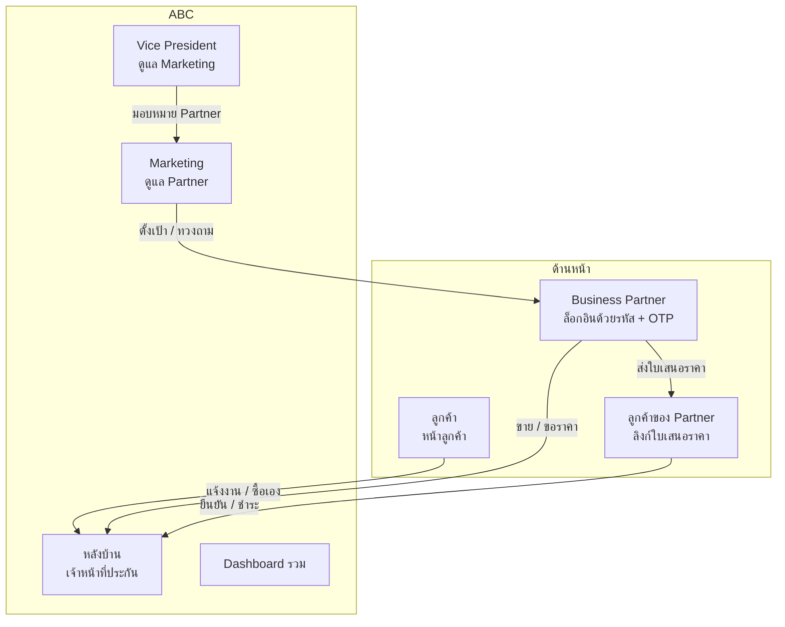
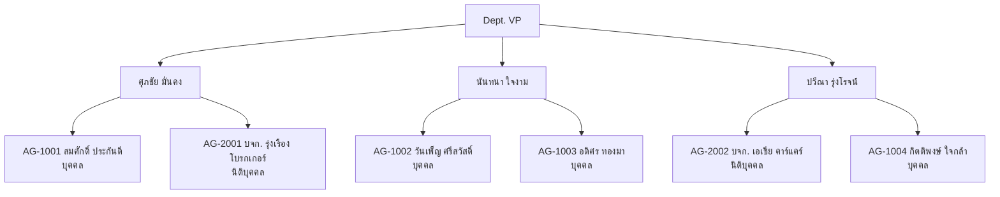
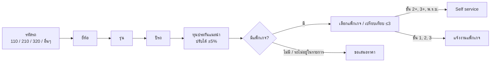
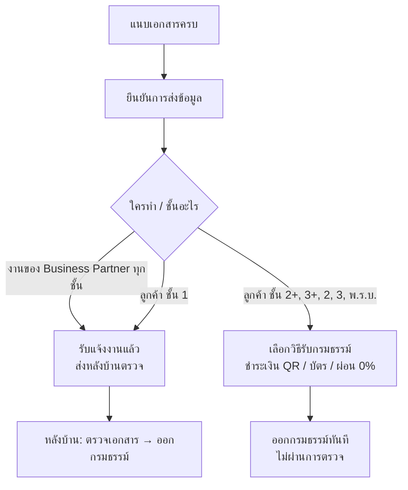
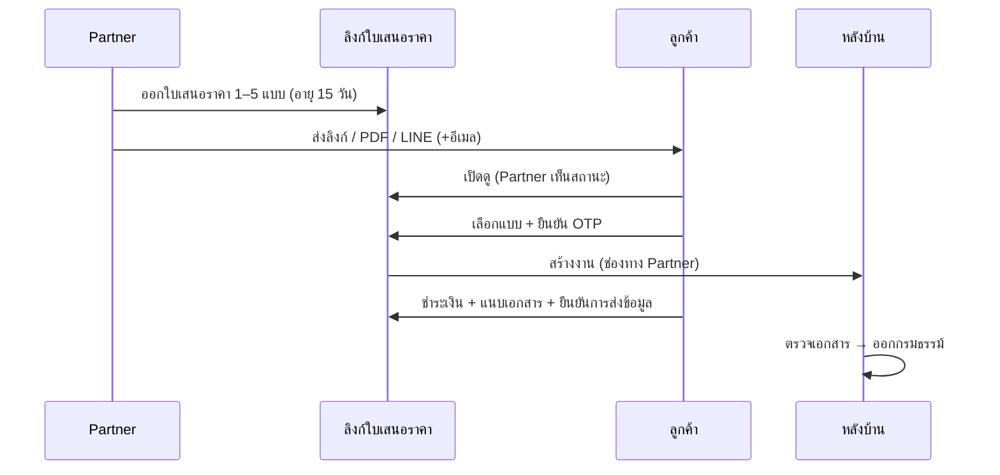
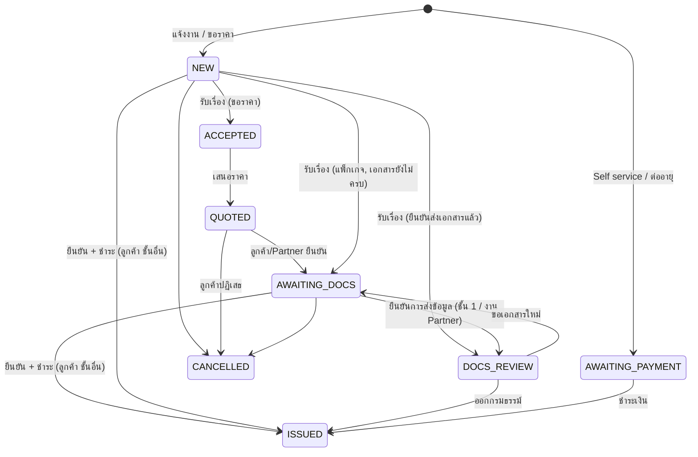
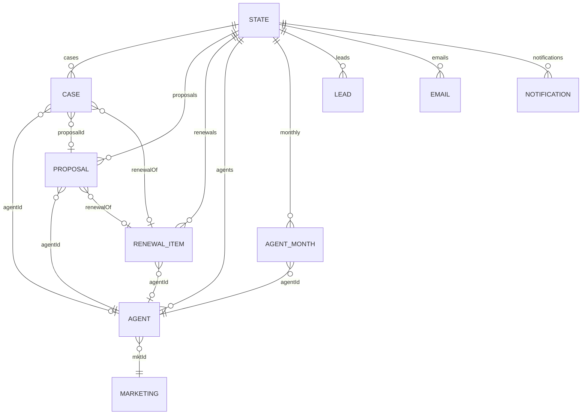

# ABC Motor Insurance Demo: โครงสร้างระบบ

เอกสารนี้อธิบายโครงสร้างของระบบจำลองการขายประกันรถยนต์ของบริษัท ABC (บริษัทสมมติ) ตั้งแต่ผู้ใช้แต่ละฝั่ง เส้นทางการทำงาน สถานะงาน กติกาธุรกิจ โครงสร้างข้อมูล ไปจนถึงโครงสร้างโค้ดและวิธี build/test

> ข้อมูลทั้งหมดเป็นตัวอย่าง: รุ่นรถ ราคา เบี้ย อัตราคอมมิชชัน ชื่อตัวแทน และเกณฑ์ต่างๆ ไม่ใช่อัตราจริง

---

## 1. ภาพรวม

| หัวข้อ | รายละเอียด |
|---|---|
| รูปแบบ | Single-page app ไฟล์ HTML ไฟล์เดียว ไม่ต้องมี server หรือ database |
| เทคโนโลยี | React 18 + TypeScript, bundle ด้วย esbuild |
| การเก็บข้อมูล | `localStorage` (state ทั้งหมด), `IndexedDB` (ไฟล์รูปที่แนบ) |
| เรียลไทม์ | `BroadcastChannel` + `storage` event ระหว่างแท็บในเบราว์เซอร์เดียวกัน |
| ภาษา | ไทย / อังกฤษ สลับได้ทุกหน้า |
| ธีม | สว่าง / มืด ตามการตั้งค่าเครื่อง |
| ฉบับ Offline | ฟอนต์และรูปฝังในไฟล์ เปิดได้โดยไม่ต้องต่ออินเทอร์เน็ต |

---

## 2. ผู้ใช้และหน้าจอ



### 2.1 เมนูด้านบน

| เมนู | ผู้ใช้ | หมายเหตุ |
|---|---|---|
| หน้าลูกค้า | ลูกค้าทั่วไป | มีปุ่ม "สำหรับตัวแทน" มุมขวาบน |
| Marketing | Marketing ของ ABC | เลือกคนหรือดูทั้งทีม |
| VP | Vice President | |
| หลังบ้าน | เจ้าหน้าที่ประกัน | เลือก "ทำงานในนาม" |
| Dashboard | ผู้บริหาร | |
| อีเมลจำลอง | ทุกคน | อีเมลถึงลูกค้า หลังบ้าน และตัวแทน |
| แบ่งจอ | ผู้นำเสนอเดโม | หน้าลูกค้า + หลังบ้านในจอเดียว |
| (ไม่มีในเมนู) Business Partner | ตัวแทน | เข้าได้ทางปุ่ม "สำหรับตัวแทน" + OTP เท่านั้น |
| (ไม่มีในเมนู) ใบเสนอราคา | ลูกค้าของ Partner | เปิดจากลิงก์ `#offer/{เลขที่}` |

### 2.2 โครงสร้างองค์กร (ข้อมูลตัวอย่าง)



- เจ้าหน้าที่หลังบ้าน 5 คน
- การย้าย Partner ระหว่าง Marketing ทำได้เฉพาะหน้า VP

---

## 3. หน้าลูกค้า

### 3.1 เลือกรถและแพ็กเกจ



- **รหัสรถ:** 110 รถเก๋ง/รถยนต์นั่ง, 210 รถตู้, 320 รถกระบะ ระบบกรองยี่ห้อและรุ่นตามรหัส
- **แคตตาล็อก:** 11 ยี่ห้อ 39 รุ่น ระบุช่วงปีที่ขายในไทยและราคารถใหม่
- **ทุนประกันแนะนำ:** ราคารถใหม่ × 0.95 × 0.9^อายุรถ (ต่ำสุด 30%) ปัดลงหลักหมื่น
- **ช่วยตัดสินใจ:** ป้ายขายดี / คุ้มที่สุด, ผ่อน 0%, ความคุ้มครองแบบสถานการณ์, เปรียบเทียบสูงสุด 3 แพ็กเกจ, "ส่งราคาให้ฉัน" (Lead)

### 3.2 แพ็กเกจ (ตัวอย่าง)

| ชั้น | เงื่อนไข | หมายเหตุ |
|---|---|---|
| ชั้น 1 | รถอายุ ≤ 10 ปี (ซ่อมห้าง ≤ 5 ปี) | ซ่อมห้าง / ซ่อมอู่ / มีค่าเสียหายส่วนแรก |
| ชั้น 2+ | รถอายุ ≤ 15 ปี ไม่ใช่ EV | ทุน 200,000 / 300,000 |
| ชั้น 3+ | รถอายุ ≤ 15 ปี ไม่ใช่ EV | ทุน 100,000 / 200,000 |
| ชั้น 2 | ไม่ใช่ EV | รถหาย/ไฟไหม้ |
| ชั้น 3 | ทุกคัน | บุคคลภายนอกเท่านั้น |
| พ.ร.บ. | ตามรหัสรถ | 110 ฿645.21, 210 ฿1,182.35, 320 ฿967.28 ซื้อพ่วงได้ |

รุ่นที่ติดป้าย `noPackage` (เช่น Mazda MX-5, Ranger Raptor, BYD Seal) ต้องขอเสนอราคาเท่านั้น

### 3.3 เอกสารที่ต้องแนบ

| กรณี | เอกสาร |
|---|---|
| ชั้น 1 | รูปรถด้านหน้า / หลัง / ซ้าย / ขวา + สำเนาเล่มรถ + สำเนาบัตรประชาชน |
| ชั้น 2+, 3+, 2, 3, พ.ร.บ. | สำเนาเล่มรถ + สำเนาบัตรประชาชน |
| ต่ออายุกับ ABC | ไม่ต้องแนบ |

- รับเฉพาะ `.jpg` ไม่เกิน 3MB ต่อรูป
- ตอนขอเสนอราคา ยังไม่ต้องแนบ แนบหลังยอมรับราคา
- ตัวช่วย:
  - ถ่ายบัตร/เล่มรถแล้ว "อ่าน" มากรอกฟอร์ม (จำลอง OCR)
  - ถ่ายรูปรถด้วยมือถือผ่าน QR (จำลอง)
  - ปุ่ม "ใช้ข้อมูลจำลอง" แนบครบในคลิกเดียว (มีลายน้ำ SAMPLE)

### 3.4 ยืนยันการส่งข้อมูล

แนบครบแล้วต้องกด **ยืนยันการส่งข้อมูล** งานจึงไปถึงหลังบ้าน (และ SLA ออกกรมธรรม์เริ่มนับ)



ใช้กับงานเลือกแพ็กเกจ งานขอเสนอราคา และงานของ Partner ส่วน Self service มีหน้าชำระเงินของตัวเองอยู่แล้ว

### 3.5 หลังได้กรมธรรม์ และติดตามคำขอ

- **หลังได้กรมธรรม์:** บัตรประกันดิจิทัล, แจ้งเคลม (แจ้งหลังบ้านทันที), ตั้งเตือนต่ออายุ 60/30/7 วันและต่อภาษี, โค้ดชวนเพื่อน
- **ติดตามคำขอ:** ค้นด้วยเลขที่คำขอ หรือเลขทะเบียน (ไม่สนช่องว่างและขีด)

---

## 4. Business Partner

### 4.1 เข้าสู่ระบบ

ปุ่ม "สำหรับตัวแทน" ที่หน้าลูกค้า → กรอกรหัสตัวแทน → OTP ส่งไปเบอร์ที่ลงทะเบียน (จำลอง) → หน้า Business Partner

- **ข้อมูลทดสอบ:** รหัส `AG-1001` ถึง `AG-1004`, `AG-2001`, `AG-2002` · OTP `246810`
- **ตัวแทนที่ถูกระงับ:** เข้าไม่ได้
- **การจำล็อกอิน:** เก็บไว้ในแท็บนั้น (`sessionStorage`) มีปุ่มออกจากระบบ

### 4.2 แท็บ

| แท็บ | หน้าที่ |
|---|---|
| ขาย / เสนอราคา | เลือกรถในหน้าเดียว · โหมด **ซื้อเลย** (1 แพ็กเกจ + พ.ร.บ., ยืนยันแทนเมื่อลูกค้ายินยอม) หรือ **ออกใบเสนอราคา** (1–5 แพ็กเกจ อายุ 15 วัน) · ให้ส่วนลด · รุ่นที่ไม่มีแพ็กเกจส่งขอราคาหลังบ้าน |
| ใบเสนอราคา | สถานะ: ยังไม่ส่ง / ส่งแล้ว / ลูกค้าเปิดดู / ยืนยัน / ไม่สนใจ / หมดอายุ · ส่งทางลิงก์ PDF LINE |
| งานของฉัน | แนบเอกสารแทนลูกค้า · ยืนยันราคาที่หลังบ้านเสนอ · เก็บเงิน · แจ้งนำส่งเบี้ย |
| รายงานต่ออายุ | Dropdown "หมดอายุใน 1 / 2 / 3 เดือน" (ค่าเริ่มต้น 1) · ต่อแล้ว / ยังไม่ต่อ · เบี้ยที่ได้รับ / คาดว่าจะได้รับ · รายการเรียงตามวันครบกำหนด |
| ผลงานของฉัน | ยอดเดือนนี้ · คอมฯ ได้รับแล้ว / รอรับ · เป้ายอดเทียบจังหวะ · งานที่ต้องติดตาม |

### 4.3 ส่วนลดและคอมมิชชัน

| ชั้น | อัตราคอมมิชชัน (ของเบี้ยสุทธิ ไม่รวม VAT และอากร) |
|---|---|
| ชั้น 1 | 18% |
| ชั้น 2+, 3+, 2, 3 | 15% |
| พ.ร.บ. | 12% |

- **ส่วนลด:** Partner ให้ส่วนลดเองได้ หักจากคอมมิชชันของตัวเอง ลดได้ไม่เกินอัตราคอมฯ ของแพ็กเกจ และ พ.ร.บ. ลดไม่ได้
- **ใบเสนอราคา:** แสดงราคาเต็มขีดฆ่าคู่กับราคาหลังหักส่วนลด ลูกค้าไม่เห็นคอมมิชชัน
- **เบี้ยสุทธิ:** เบี้ยรวม ÷ 1.07428

### 4.4 การชำระเงินและนำส่งเบี้ย

| ช่องทาง | กำหนด | สถานะ |
|---|---|---|
| ลูกค้าจ่ายผ่านลิงก์ | ภายใน 15 วันหลังยืนยัน | ตามเกณฑ์ / ชำระล่าช้า / รอชำระ / เกินกำหนด |
| Partner เก็บเงินแล้วนำส่ง | ภายใน 15 วันหลังออกกรมธรรม์ | ตามเกณฑ์ / ชำระล่าช้า / รอนำส่ง / เกินกำหนด |

คอมมิชชันนับเป็น "ได้รับแล้ว" เมื่อ ABC ได้รับเงินครบ

### 4.5 ใบเสนอราคา (หน้าลูกค้าของ Partner)



### 4.6 ต่ออายุกับ ABC

1. Partner กด "ออกใบเสนอต่ออายุ" จากรายงานต่ออายุ ระบบกรอกรถและลูกค้าจากกรมธรรม์เดิม
2. ลูกค้าตกลง (ซื้อเลย หรือผ่านลิงก์) แล้ว **ไม่ต้องแนบเอกสาร**
3. ลูกค้าจ่ายผ่านลิงก์ หรือ Partner กด "เก็บเงินจากลูกค้าแล้ว" → ออกกรมธรรม์ใหม่ทันที
4. งานต่ออายุไม่นับ SLA และถ้าเปลี่ยนรถในฟอร์ม จะกลายเป็นงานใหม่ปกติ

---

## 5. Marketing

| แท็บ | หน้าที่ |
|---|---|
| ผลงานตัวแทน | เบี้ย คอมฯ เป้า อัตราปิดการขาย (ใบเสนอที่ยืนยัน ÷ ใบเสนอที่ออก) ส่วนลดเฉลี่ย · เดือนนี้ / 90 วัน |
| การต่ออายุ | อัตราต่ออายุรวมและราย Partner · เบี้ยที่ได้รับ / คาดว่าจะได้รับ · รายการยังไม่ต่อพร้อมปุ่มทวงถาม |
| ตั้งเป้า / จัดการตัวแทน | เป้า/เดือน (แก้ได้) · ทำได้เดือนนี้ · % ทำได้เทียบจังหวะ · ระงับ / เปิดใช้ |
| ติดตามงาน | ต่ออายุที่ครบใน 60 วัน · เบี้ยเกินกำหนด · ทวงถาม (อีเมลถึงตัวแทน) |

---

## 6. Vice President

- **ช่วงเวลา:**
  - **Rolling 12 เดือน:** 12 เดือนที่ปิดยอดแล้ว
  - **เดือนนี้:** ยอดถึงวันนี้ เทียบเป้าตามสัดส่วนวัน
- **ตัวเลขสรุป:** GWP เทียบเป้า, จำนวนกรมธรรม์, อัตราต่ออายุ + GWP ต่ออายุ, Loss Ratio
- **โครงสร้างและอันดับ:** VP → Marketing → Partner เรียงตาม % ทำได้
- **กราฟ Rolling 12 เดือน:** Clustered bar ราย Partner (สีตาม Marketing, Partner คนที่สองเป็นลายเส้น) หรือราย Marketing · % เป้า / GWP · ดูเป็นตารางได้
- **อันดับ Marketing:** เป้า, จริง, % ทำได้, กรมธรรม์, สัดส่วน, อัตราต่ออายุ, GWP ต่ออายุ, Loss Ratio
- **Performance ราย Partner:** ตัวเลขเดียวกัน และ **มอบหมาย Marketing ผู้ดูแล** (ทำได้ที่หน้านี้เท่านั้น)
- **เกณฑ์ Loss Ratio (ตัวอย่าง):** ≤55% ปกติ, ≤70% เฝ้าระวัง, >70% สูง

---

## 7. หลังบ้าน

### 7.1 แท็บ

| แท็บ | หน้าที่ |
|---|---|
| งาน | คิวงาน ตัวกรอง (สถานะ ชั้น ช่องทาง/Partner ผู้รับผิดชอบ) · รับเรื่อง มอบหมาย เสนอราคา ตรวจเอกสาร ขอเอกสารใหม่ ออกกรมธรรม์ ยกเลิก โน้ต · กล่องข้อมูล Partner (ส่วนลด คอมฯ การชำระ) |
| ผู้สนใจ (Leads) | คนที่กด "ส่งราคาให้ฉัน" · ทำเครื่องหมายติดต่อแล้ว |
| นำส่งเบี้ย | เบี้ยที่ Partner เก็บเอง · บันทึกรับเงินนำส่ง · แจ้งเตือนเมื่อ Partner แจ้งว่าโอนแล้ว |

### 7.2 สถานะงาน



| สถานะ | ความหมาย |
|---|---|
| `NEW` | ใหม่ รอรับเรื่อง |
| `AWAITING_PAYMENT` | รอชำระเงิน (Self service, ต่ออายุ) |
| `ACCEPTED` | รับเรื่องแล้ว (ขอเสนอราคา) |
| `QUOTED` | เสนอราคาแล้ว รอลูกค้ายืนยัน |
| `AWAITING_DOCS` | รอเอกสาร / รอยืนยันการส่งข้อมูล |
| `DOCS_REVIEW` | ตรวจเอกสาร |
| `ISSUED` | ออกกรมธรรม์แล้ว |
| `CANCELLED` | ยกเลิก |

### 7.3 SLA

นับเฉพาะเวลาทำการ จันทร์–ศุกร์ 08:30–17:30 (เวลาไทย) ไม่หักวันหยุดนักขัตฤกษ์

| SLA | เริ่มนับ | หยุดนับ | เป้าหมาย |
|---|---|---|---|
| รับเรื่อง | ส่งคำขอ | รับเรื่อง | 15 นาที |
| เสนอราคา | ส่งคำขอเสนอราคา | ส่งใบเสนอราคา | 2 ชั่วโมง |
| ออกกรมธรรม์ | ยืนยันการส่งข้อมูล (หรือรับเรื่อง ถ้าทีหลัง) | ออกกรมธรรม์ | 1 วันทำการ |

- **ไม่นับ SLA:** Self service และงานต่ออายุ
- **เมื่อเกิน SLA:** แจ้งเตือนหลังบ้านและส่งอีเมลถึงทีมหนึ่งครั้ง

---

## 8. Dashboard

- **ตัวกรอง:** ช่วงเวลา (7 / 30 / 90 วัน / เดือนนี้), ประเภท, ยี่ห้อ, เจ้าหน้าที่, ช่องทาง (ตรง / Partner), Marketing
- **KPI:** กรมธรรม์ที่ออก, เบี้ยรวม, อัตราแปลงเป็นกรมธรรม์, SLA ผ่าน
- **Production:** รายวัน / รายเดือน แยกตามประเภท ยี่ห้อ เจ้าหน้าที่
- **ช่องทาง Partner:**
  - อันดับ Partner
  - Funnel ตัวแทน: ออกใบเสนอ → เปิดดู → ยืนยัน → ออกกรมธรรม์ → ABC ได้รับเงิน
  - รายละเอียดการชำระ
  - Performance งานต่ออายุ
- **Process Funnel:** เข้าชมเว็บ → เลือกรถ → ดูแพ็กเกจ → เลือก → แจ้งงาน → … → ออกกรมธรรม์ พร้อม Leads
- **SLA:** % ผ่านแต่ละ SLA, ค่าเฉลี่ย, P90, รายเจ้าหน้าที่, งานที่เกิน SLA

---

## 9. อีเมลจำลอง

| ถึง | อีเมล |
|---|---|
| ลูกค้า | ได้รับคำขอ · รายการเอกสารที่ต้องแนบ · ใบเสนอราคา · ขอเอกสารใหม่ · ออกกรมธรรม์ · ซื้อเองสำเร็จ · ยกเลิก · ส่งราคาให้ (Lead) · แจ้งเคลม · เตือนต่ออายุ · ใบเสนอราคาจาก Partner |
| หลังบ้าน | งานใหม่ · ลูกค้ายืนยัน · เอกสารครบ · เกิน SLA |
| ตัวแทน | ทวงถามต่ออายุ · ทวงถามนำส่งเบี้ย · ขอเอกสารใหม่ (งานของตัวเอง) |

---

## 10. โครงสร้างข้อมูล



| ข้อมูล | ฟิลด์สำคัญ |
|---|---|
| `Case` (งาน) | `id` (ABC-YYMM-NNNN), `source` (package / quote / self), `vehicle`, `coverage`, `pkg`, `addCmi`, `customer`, `status`, `stamps` (submitted, accepted, quoted, confirmed, docsComplete, paid, issued, cancelled), `docs`, `log`, `policyNo`, `premium` · ช่องทาง Partner: `agentId`, `proposalId`, `discount`, `collect` (link / agent), `paidAt`, `remittedAt` · `renewalOf` |
| `Proposal` (ใบเสนอราคา) | `id` (Q-YYMM-…), `agentId`, `options[]` (pkg + addCmi), `discountPct`, `expiresAt`, `sentVia`, `viewedAt`, `status`, `acceptedBy`, `chosen`, `caseId`, `renewalOf` |
| `Agent` | `code`, `kind` (person / company), ชื่อ, ใบอนุญาต, จังหวัด, เบอร์, LINE, `mktId`, `target` (บาท/เดือน), `active` |
| `Marketing` | `id`, ชื่อ, เบอร์ |
| `RenewalItem` | `policyNo`, ลูกค้า, รถ, ชั้น, เบี้ยเดิม, `expiry`, `status` (open / quoted / renewed / lost), `renewedPremium`, `proposalId`, `nudgedAt` |
| `AgentMonth` | ราย Partner รายเดือน: `gwp`, `policies` (ประวัติก่อนข้อมูลตัวอย่าง), `lossRatio`, `renewDue`, `renewed`, `renewGwp` |
| `Lead` | ผู้ติดต่อ, รถ, ราคาเริ่มต้น, `contacted`, `caseId` เมื่อกลายเป็นงาน |
| `Email`, `Notification` | อีเมลจำลองและแจ้งเตือนหลังบ้าน |

- **ข้อมูลตัวอย่าง:** สร้างตอนเปิดครั้งแรก ประมาณ 320 งานย้อนหลัง 3 เดือน (ราว 1/3 ผ่าน Partner), ใบเสนอราคาที่ปิดและไม่ปิด, 260 กรมธรรม์ใกล้ครบกำหนด, ประวัติ 13 เดือนราย Partner
- **Store version:** เปลี่ยนแล้วข้อมูลเดิมในเบราว์เซอร์จะถูกสร้างใหม่ ปุ่ม "รีเซ็ตข้อมูลเดโม" สร้างใหม่ได้ทุกเมื่อ

---

## 11. โครงสร้างโค้ด

```
assets/
  cars/*.webp          รูปรถ (ตัดพื้นหลัง, Muted)
  fonts/               ฟอนต์ Mitr, IBM Plex Sans Thai, IBM Plex Mono
  README-offline.txt   คู่มือในไฟล์ zip ฉบับ Offline
docs/
  SYSTEM_STRUCTURE.md  เอกสารนี้
scripts/
  build.mjs            bundle เป็น dist/index.html, dist/fragment.html, dist/offline/
  e2e.mjs              ทดสอบ end-to-end (Playwright)
  offline-check.mjs    เปิดฉบับ Offline โดยบล็อกเน็ตทั้งหมด
  fetch-fonts.mjs      ดึงฟอนต์มาเก็บใน assets/fonts
src/
  main.tsx             เมนูด้านบน, เลือกหน้า, toast, session ของ Partner
  types.ts             ชนิดข้อมูลทั้งหมด
  store.ts             state + action ทั้งหมด (จุดเดียวที่เปลี่ยนข้อมูล)
  files.ts             เก็บรูปที่แนบใน IndexedDB
  i18n.ts, i18nAgent.ts   ข้อความไทย/อังกฤษ, รูปแบบตัวเลข/วันที่
  styles.css           ธีม, สีโหมดสว่าง/มืด, layout ทุกหน้า
  data/
    vehicles.ts        ยี่ห้อ รุ่น ปี ราคา รหัสรถ ทุนประกัน
    packages.ts        แพ็กเกจ เบี้ย พ.ร.บ. เอกสารที่ต้องใช้ ผ่อน 0%
    agents.ts          Partner, Marketing, คอมมิชชัน, ราคาหลังส่วนลด, สถานะการชำระ
    brandLogos.ts      โลโก้ยี่ห้อ (Simple Icons, CC0)
  lib/
    time.ts            เวลาไทย, นาทีทำการ
    sla.ts             คำนวณ SLA
    seed.ts            ข้อมูลตัวอย่าง (งาน, Lead, traffic, ใบเสนอราคา, ต่ออายุ)
    history.ts         ประวัติ 12 เดือนราย Partner สำหรับ VP
  ui/
    Customer.tsx       หน้าลูกค้า: เลือกรถ, แพ็กเกจ, ฟอร์ม, ชำระเงิน, ติดตาม, แนบเอกสาร
    SubmitDocs.tsx     ปุ่มและหน้าต่าง "ยืนยันการส่งข้อมูล"
    PartnerLogin.tsx   ล็อกอิน Business Partner (รหัส + OTP)
    Agent.tsx          หน้า Business Partner
    AgentRenewals.tsx  รายงานต่ออายุ (Partner และ Marketing)
    Offer.tsx          ใบเสนอราคาสำหรับลูกค้า, แชร์ลิงก์/PDF/LINE
    Marketing.tsx      หน้า Marketing
    VP.tsx             หน้า Vice President
    BackOffice.tsx     หลังบ้าน
    Dashboard.tsx, DashAgents.tsx   Dashboard
    Mail.tsx           อีเมลจำลอง
    extras.tsx         OCR จำลอง, ถ่ายด้วยมือถือ, รูป/เอกสารจำลอง, หลังได้กรมธรรม์, เคลม
    charts.tsx         กราฟแท่ง, Clustered bar, แถบแนวนอน
    icons.tsx          โลโก้ยี่ห้อ, รูปรถ, QR จำลอง
    common.tsx         ป้ายสถานะ, SLA chip, Field, Segmented, Toast
```

### 11.1 Action หลักใน `store.ts`

| กลุ่ม | Action |
|---|---|
| งาน | `submitCase`, `acceptCase`, `assignCase`, `sendQuote`, `customerConfirm`, `customerDecline`, `cancelCase`, `addNote` |
| เอกสาร | `uploadDoc`, `submitDocs`, `requestReupload` |
| ออกกรมธรรม์ / ชำระ | `issuePolicy`, `payAndIssue` (Self service), `submitPayIssue` (ยืนยัน + ชำระ) |
| Partner | `createProposal`, `markProposalSent`, `viewProposal`, `declineProposal`, `acceptProposal`, `payByLink`, `agentCollected`, `agentRemitNotice`, `recordRemit` |
| Marketing / VP | `nudgeAgent`, `updateAgent` (เป้า, ระงับ, Marketing ผู้ดูแล) |
| อื่นๆ | `captureLead`, `markLeadContacted`, `fileClaim`, `setReminders`, `sendRenewalPreview`, `trackStep`, `checkSlaBreaches`, `markNotificationsRead`, `resetDemo` |

ถ้าจะต่อยอดไปใช้จริง ให้เปลี่ยน action ใน `store.ts` และ `files.ts` ให้เรียก API จริง โดยหน้าจอไม่ต้องแก้

---

## 12. Build และทดสอบ

```bash
npm install
npm run typecheck
npm run build                                          # dist/index.html, dist/fragment.html, dist/offline/
npm run package:offline                                # dist/abc-motor-insurance-demo-offline.zip
CHROMIUM_PATH=/path/to/chromium npm test               # end-to-end 43 ขั้น
CHROMIUM_PATH=/path/to/chromium npm run test:offline   # ฉบับ Offline ไม่มี network request
```

การทดสอบ end-to-end ครอบคลุม:
- ลูกค้า: เลือกแพ็กเกจ, ขอเสนอราคา, Self service, ยืนยันการส่งข้อมูล, ขอเอกสารใหม่
- หลังบ้าน
- Business Partner: ล็อกอิน OTP, ใบเสนอราคา, ส่วนลด, ต่ออายุ, นำส่งเบี้ย
- Marketing และ VP
- Dashboard
- ภาษาอังกฤษ

---

## 13. ข้อจำกัดของเดโม

- ข้อมูลอยู่ในเบราว์เซอร์ที่เปิดเท่านั้น ไม่แชร์ข้ามเครื่อง อีเมล OTP การชำระเงิน และ EMS เป็นการจำลอง
- หน้า Marketing / VP / หลังบ้าน / Dashboard เปิดได้โดยไม่ต้องล็อกอิน (มีแค่ Business Partner ที่ต้องล็อกอิน)
- ยอดก่อนช่วงข้อมูลตัวอย่าง Loss Ratio และผลต่ออายุรายเดือนในหน้า VP เป็นข้อมูลจำลอง ประวัติ 12 เดือนนับ Partner ตาม Marketing ผู้ดูแลปัจจุบัน
- โลโก้ยี่ห้อเป็นเครื่องหมายการค้าของเจ้าของ ใช้เพื่อระบุยี่ห้อรถเท่านั้น

---

Designed By Jack Na Ja
